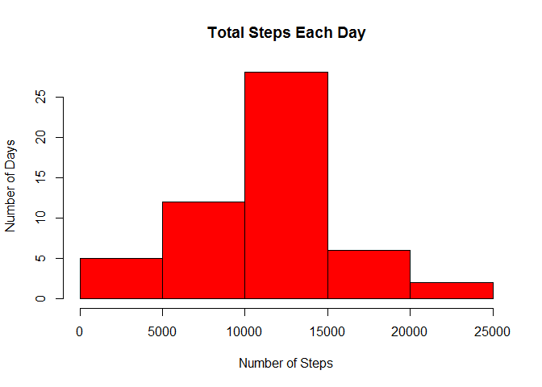
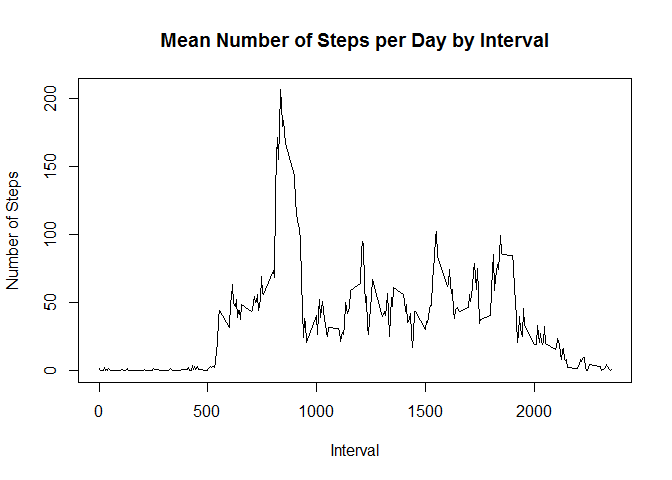
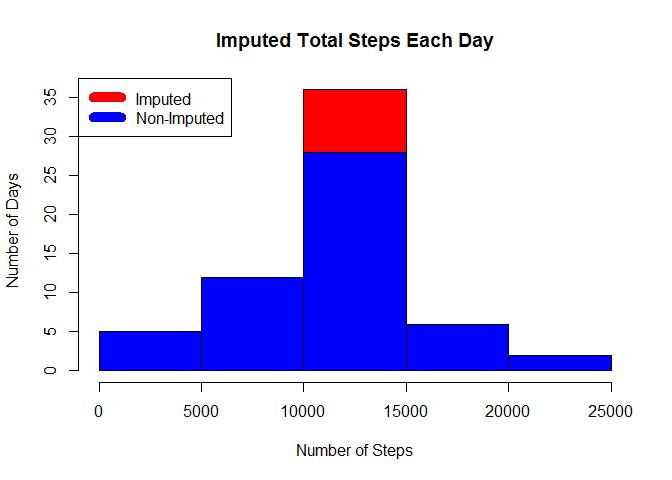

# Reproducible Research: Peer Assessment 1
David Heeszel  
11/30/2016  
###About
This is the first peer-reviewed practical in the **Reproducible Research** course available on Coursera. The purpose of the practical is to answer a series of questions using data collected by an exercise tracker (e.g. Fitbit).

##Project Purpose
* practice loading and pre-processing data
* develop a method for imputing missing data
* interpret data in order to answer research questions

##Data
The data for this assignment was downloaded via the course Github repository:
https://github.com/rdpeng/RepData_PeerAssessment1

###Variables 
* **steps**: Number of steps taken in a 5 minute interval (missing values recorded as `NA`)
* **date**: The date on which the dat was recorded [YYYY-MM-DD]
* **interval**: Identifier for the 5 minute interval in which measurement was taken

The raw dataset is stored as a .csv file.

## Loading and preprocessing the data

```r
      data_raw<-read.csv("data/activity.csv")
```

## What is mean total number of steps taken per day?
*Sum the number of steps by day

```r
      steps_by_day<-aggregate(steps ~date, data_raw, sum)
      hist(steps_by_day$steps,main="Total Steps Each Day", col="red",xlab="Number of Steps",ylab="Number of Days")
```

<!-- -->

```r
      steps_median<-median(steps_by_day$steps)
      steps_mean<-mean(steps_by_day$steps)
```
The `mean` is 1.0766189\times 10^{4}, and the `median` is 10765.


## What is the average daily activity pattern?
* Calculate average steps for each interval for all days
* Plot the average number of steps per day by interval
* Find the interval with the most average steps


```r
      steps_by_interval<-aggregate(steps~interval,data_raw,mean)
      plot(steps_by_interval$interval,steps_by_interval$steps,type="l",xlab="Interval",ylab="Number of Steps",main="Mean Number of Steps per Day by Interval")
```

<!-- -->

```r
      max_interval<- steps_by_interval[which.max(steps_by_interval$steps),1]
```
The 5 minute interval, on average, across all days in the data set, containing the maximum number of steps is 835.

## Imputing missing values
Missing data may be imputed. Keep it simple though...
Here we will impute missing values by inserting the average number of steps for each interval.  If interval 15 was missing on 10-01-2012, the average value for interval 15 replaces the NA.


```r
      inc<-sum(!complete.cases(data_raw))
      imputed<-transform(data_raw,steps=ifelse(is.na(data_raw$steps),steps_by_interval$steps[match(data_raw$interval,steps_by_interval$interval)],data_raw$steps))
```
Recount steps by day and create a histogram.

```r
      imputed_steps<-aggregate(steps~date,imputed,sum)
      hist(imputed_steps$steps,main="Imputed Total Steps Each Day",col="red",xlab="Number of Steps",ylab="Number of Days")

#Histogram showing the difference
      hist(steps_by_day$steps,col="blue",add=TRUE)
      legend("topleft",c("Imputed", "Non-Imputed"),col=c("red","blue"),lwd=10)
```

<!-- -->

Determine impact of imputation on mean and median of data.


```r
      isteps_median<-median(imputed_steps$steps)
      isteps_mean<-mean(imputed_steps$steps)
      delta_median<-steps_median-isteps_median
      delta_mean<-steps_mean-isteps_mean
```
* The imputed mean total daily steps is 1.0766189\times 10^{4}
* The imputed median total daily steps is 1.0766189\times 10^{4}
* The impact of imputation on the mean total daily steps is 0 steps
* The impact of imputation on the median total daily steps is -1.1886792 steps
* We can conclude that imputing missing data has a negligible impact on both the mean and the median using the method applied above


## Are there differences in activity patterns between weekdays and weekends?

###Create a plot to compare the number of steps taken on weekdays with those taken on weekends
Create a new factor variable in the data with two levels - 'Weekday' and 'Weekend'

* Operate on the imputed data


```r
      wdays<-c("Monday", "Tuesday", "Wednesday", "Thursday", "Friday")
      imputed$dow=as.factor(ifelse(is.element(weekdays(as.Date(imputed$date)),wdays),"Weekday","Weekend"))
      imputed_steps_interval<-aggregate(steps~interval+dow,imputed,mean)
      library(lattice)
```

```
## Warning: package 'lattice' was built under R version 3.3.1
```

```r
      xyplot(imputed_steps_interval$steps~imputed_steps_interval$interval|imputed_steps_interval$dow,main="Average Steps per Day by Interval",xlab="Interval",ylab="Steps",layout=c(1,2),type="l")
```

<!-- -->

## From the plot we can see

* The subject generally moves less early in the day on weekends [Interval 500-750]
* The subject is more active on average during the whole day on weekends
